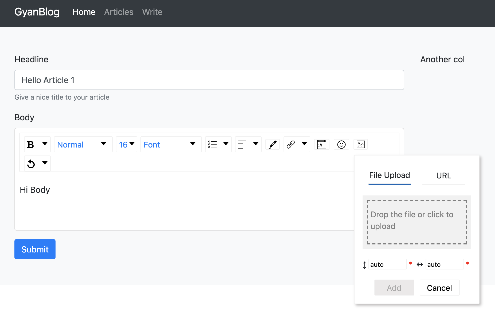
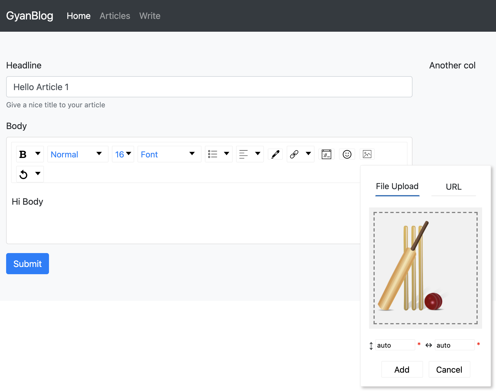
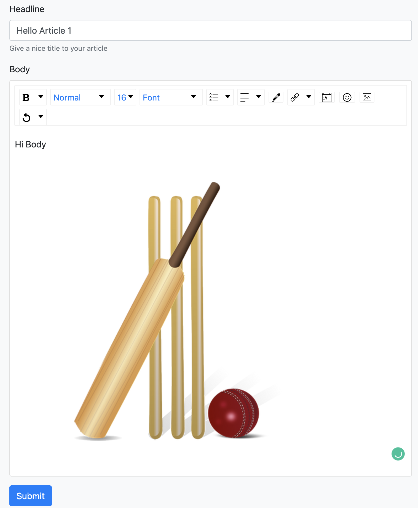
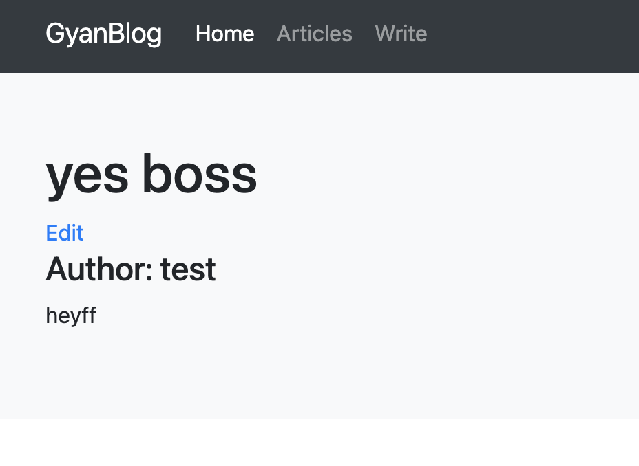
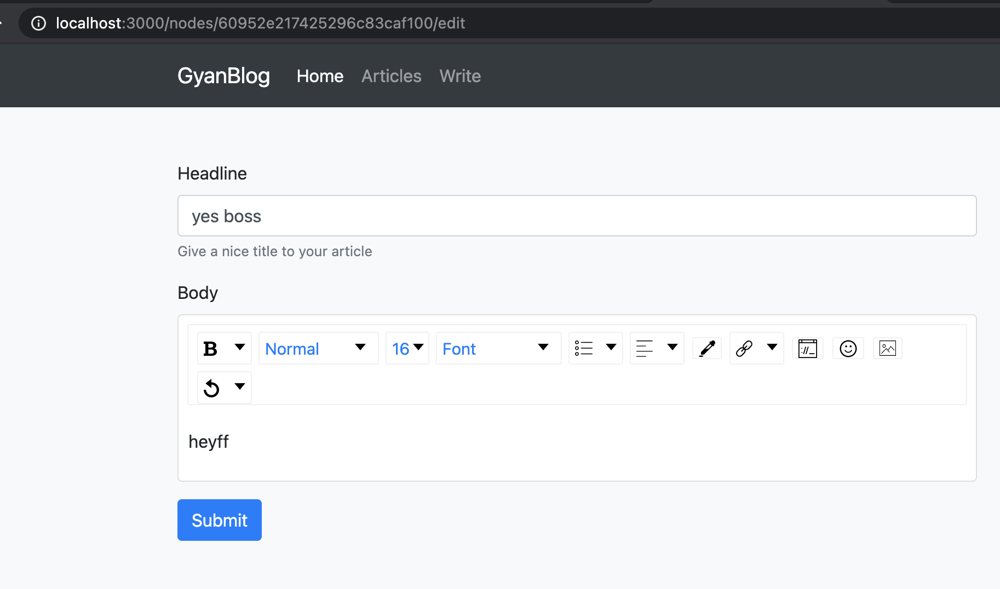

# next-js-draft-js-strapi-bootstrap
Complete project for Next.js and Draft.js with Strapi and Bootstrap.

The project contains complete code for managing articles. Following are there:

- Next.js integration with Strapi
- Next.js with Bootstrap
- Create article page with Draft.js
- Edit article page with Draft.js
- Draft.js component

## Pre-requisites
The code does not cover strapi. 
For setup strapi for this, see https://www.gyanblog.com/javascript/strapi-backend-api-setup-mongodb/

## Run

```
npm run dev
```

Open http://localhost:3000/

## Code Structure Understanding
https://www.gyablog.com/javascript/how-integrate-next-js-draft-js-strapi-create-article-upload-image-view-page/

https://www.gyablog.com/javascript/how-integrate-next-js-draft-js-strapi-edit-article-redirect-slug/

## Screenshots









